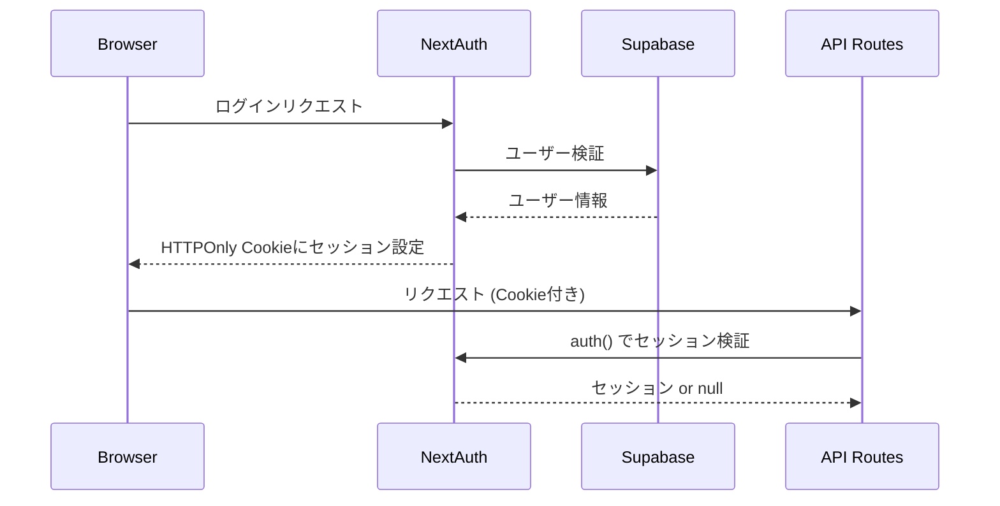

# 技術仕様書 (Architecture Design Document)

## テクノロジースタック

### 言語・ランタイム

| 技術 | バージョン | 理由 |
|------|-----------|------|
| Node.js | v22.x (LTS) | 2027年まで長期サポート保証。非同期I/O処理に優れSSR/APIサーバー両立 |
| TypeScript | 5.x | 静的型付けによる品質保証。エンジニア向けプロダクトとして型定義自体がドキュメントになる |
| npm | 10.x | Node.js LTSに同梱。workspaces対応・package-lock.jsonによる再現性の担保 |

### フレームワーク・ライブラリ

| 技術 | バージョン | 用途 | 選定理由 |
|------|-----------|------|----------|
| Next.js | 15.x | フルスタックフレームワーク | App Router / API Routes / SSR-CSRの柔軟な切り替え。Vercelとの親和性が高くデプロイが容易 |
| React | 19.x | UIライブラリ | Next.jsに内包。エコシステムが最大級でUIコンポーネントの選択肢が豊富 |
| Tailwind CSS | 4.x | スタイリング | ユーティリティファーストで一貫したデザインシステムを維持しやすい。レスポンシブ対応が容易 |
| Prisma | 6.x | ORM | TypeScript型安全なDB操作。マイグレーション管理が簡潔 |
| NextAuth.js | 5.x (Auth.js) | 認証 | Google OAuth・メールパスワード認証に対応。Next.js App Routerとの統合が公式サポート |
| react-markdown | 9.x | Markdownレンダリング | rehype-sanitize と組み合わせてXSS安全なMarkdown描画が可能 |
| mermaid | 11.x | ダイアグラム描画 | シーケンス図・ER図・フローチャートをコードから描画。動的インポートでバンドル分割可能 |
| @google/generative-ai | 0.x | Gemini API クライアント | カード自動生成機能。無料枠あり(Gemini 2.5 Flash: 15RPM・100万トークン/日) |
| Zod | 3.x | バリデーション | TypeScriptとの親和性が高く、API入力の型安全バリデーションを実現 |

### データベース・インフラ

| 技術 | 用途 | 選定理由 |
|------|------|----------|
| Supabase (PostgreSQL) | メインDB | RLS(行レベルセキュリティ)が標準機能として提供。マルチユーザー対応に最適。無料枠あり |
| Vercel | ホスティング | Next.jsの開発元。Edge NetworkによるグローバルCDNとゼロコンフィグデプロイ |

### 開発ツール

| 技術 | バージョン | 用途 | 選定理由 |
|------|-----------|------|----------|
| ESLint | 9.x | Lint | Next.js公式設定に対応。コードスタイル統一 |
| Prettier | 3.x | フォーマッター | ESLintと連携。自動フォーマットで議論を排除 |
| Vitest | 2.x | ユニット・統合テスト | Vite互換・TypeScript対応・高速。Jest互換APIで移行コスト低 |
| Playwright | 1.x | E2Eテスト | クロスブラウザ対応・モバイルビューポートのエミュレーションが可能 |

---

## アーキテクチャパターン

### レイヤードアーキテクチャ

```
┌──────────────────────────────────────┐
│  プレゼンテーション層                  │
│  Next.js App Router (RSC + Client)   │ ← UI表示・ユーザーインタラクション
├──────────────────────────────────────┤
│  APIレイヤー                          │
│  Next.js API Routes                  │ ← HTTPリクエスト処理・認証検証・バリデーション
├──────────────────────────────────────┤
│  サービスレイヤー                      │
│  Service classes (SM2, AI, Stats...) │ ← ビジネスロジック
├──────────────────────────────────────┤
│  データアクセス層                      │
│  Prisma Client                       │ ← DB操作の抽象化
├──────────────────────────────────────┤
│  データ永続化層                        │
│  PostgreSQL (Supabase)               │ ← データの保存
└──────────────────────────────────────┘
```

#### プレゼンテーション層
- **責務**: UIレンダリング・ユーザー入力の受付・クライアントサイドの状態管理
- **許可される操作**: APIレイヤーへのfetch呼び出し
- **禁止される操作**: サービスレイヤー・Prismaへの直接アクセス

#### APIレイヤー
- **責務**: HTTPリクエスト/レスポンスの処理、認証セッション検証、Zodによる入力バリデーション
- **許可される操作**: サービスレイヤーの呼び出し
- **禁止される操作**: ビジネスロジックの直接実装

#### サービスレイヤー
- **責務**: SM-2計算・AI生成・統計集計などのビジネスロジック実装
- **許可される操作**: Prisma Clientの呼び出し、外部API呼び出し
- **禁止される操作**: HTTPリクエスト/レスポンスへの依存

#### データアクセス層 (Prisma)
- **責務**: SQL生成・マイグレーション・型安全なDB操作
- **許可される操作**: PostgreSQLへのクエリ発行
- **禁止される操作**: ビジネスロジックの実装

---

## ディレクトリ構成

詳細なディレクトリ構成・各ディレクトリの役割・依存ルールは [リポジトリ構造定義書](./repository-structure.md) を参照。

---

## データ永続化戦略

### ストレージ方式

| データ種別 | ストレージ | 理由 |
|-----------|----------|------|
| ユーザー・デッキ・カード・復習ログ | Supabase PostgreSQL | ACID準拠・RLSによるマルチユーザー分離 |
| 認証セッション | NextAuth.js (Supabase Adapter) | DBベースのセッション管理で永続化 |
| 環境変数 (APIキー等) | Vercel環境変数 / .env.local | コードに機密情報を含めない |

### バックアップ戦略
- **Supabase自動バックアップ**: 日次スナップショット (有料プランでPITR対応)
- **マイグレーション管理**: `prisma/migrations/` をGit管理し、スキーマ変更を追跡

---

## パフォーマンス要件

### レスポンスタイム

| 操作 | 目標時間 | 対策 |
|------|---------|------|
| 初期ページ読み込み | 2秒以内 (3G回線) | RSCによるSSR・画像なし方針・Mermaidの動的インポート |
| 今日の復習カード取得 | 500ms以内 | `(userId, nextReviewDate)` 複合インデックス |
| カードフリップアニメーション | 16ms以内 (60fps) | CSS transformのみ使用・JSでレイアウトを触らない |
| AI カード生成 | 30秒以内 | 構造化JSON (カードリスト) を一括返却。ローディング表示でユーザーに進行中を伝える |

### リソース使用量

| リソース | 上限 | 理由 |
|---------|------|------|
| DBコネクション | Prismaコネクションプーリング (max: 10) | Supabase無料枠の接続数制限に対応 |
| Gemini API | 1リクエスト/ユーザー/分 | 無料枠レート制限(15RPM)内に収めるためユーザー単位で制限 |

---

## セキュリティアーキテクチャ

### データ保護

- **通信暗号化**: HTTPS必須 (Vercelがデフォルト強制)
- **行レベルセキュリティ (RLS)**: Supabase PostgreSQLのRLSポリシーにより `userId` が一致するレコードのみ操作可能
- **機密情報管理**: APIキー・DB接続文字列はすべて環境変数で管理、コードにハードコードしない

### 認証フロー



### 入力検証

- **APIルート**: Zodスキーマで全リクエストボディを検証。型不正・文字数超過を400エラーで返す
- **Markdownサニタイズ**: `rehype-sanitize` によりXSSを防止 (`<script>` タグ等を除去)
- **Gemini API入力**: テキスト最大5,000文字に制限し、プロンプトインジェクション対策としてシステムプロンプト(systemInstruction)をユーザー入力と分離

---

## スケーラビリティ設計

### データ増加への対応

- **想定データ量**: 1ユーザーあたり最大5,000枚のカード
- **インデックス設計**:
  - `Card(userId, nextReviewDate)`: 今日の復習カード取得のメインクエリを最適化
  - `Card(deckId)`: デッキ別カード一覧取得
  - `ReviewLog(userId, reviewedAt)`: 統計・ヒートマップクエリ
- **ページネーション**: カード一覧は20件/ページのカーソルベースページネーション。APIレスポンスに `nextCursor`(次ページの起点となるカードID)を含め、クライアントは次リクエストの `?cursor=` クエリパラメータとして渡す

### 機能拡張性

- **AI プロバイダー差し替え**: `AIGeneratorService` インターフェースを抽象化し、他のLLMプロバイダー（OpenAI・Claude等）への切り替えを容易にする
- **カードタイプの追加**: `CardType` の Union型拡張と対応レンダラーコンポーネントの追加で対応可能
- **学習アルゴリズムの差し替え**: `SM2Service` を `SpacedRepetitionService` インターフェースに抽象化済み

---

## テスト戦略

### ユニットテスト (Vitest)
- **対象**: `SM2Service`・`StatsService`・Zodバリデーションスキーマ・ユーティリティ関数
- **カバレッジ目標**: 80%以上 (SM-2アルゴリズムは100%)
- **方針**: 外部依存(DB・API)はモック化

### 統合テスト (Vitest + Prisma)
- **対象**: APIルートのハンドラー関数
- **方針**: テスト用のSupabaseプロジェクト or ローカルDockerのPostgreSQLを使用。RLSポリシーも含めて検証

### E2Eテスト (Playwright)
- **対象シナリオ**:
  - 新規登録 → デッキ作成 → カード作成 → 復習セッション完了
  - AI カード生成 → 編集 → 保存
- **モバイルテスト**: iPhone 14 (375×812) ビューポートでのタップ操作を検証

---

## 技術的制約

### 環境要件
- **ブラウザサポート**: モダンブラウザ最新2バージョン (Chrome / Safari / Firefox)
- **必要な環境変数**:
  ```
  DATABASE_URL          # Supabase PostgreSQL接続文字列
  DIRECT_URL            # Prisma Migrate用の直接接続URL
  NEXTAUTH_SECRET       # セッション暗号化キー
  NEXTAUTH_URL          # アプリのベースURL
  GOOGLE_CLIENT_ID      # Google OAuth
  GOOGLE_CLIENT_SECRET  # Google OAuth
  GEMINI_API_KEY        # Gemini API
  ```

### パフォーマンス制約
- Supabase無料枠: DB接続数上限10、ストレージ500MB
- Vercel無料枠: サーバーレス関数実行時間 10秒 (AI生成のみ60秒に延長設定)
- Gemini API 無料枠: 15RPM・100万トークン/日の上限に注意 (ユーザー単位でレート制限を実装)

### セキュリティ制約
- パスワードはNextAuth.jsがbcryptでハッシュ化 (コードで直接扱わない)
- `GEMINI_API_KEY` はサーバーサイドのみでアクセス可能 (クライアントに露出禁止)

---

## 依存関係管理

| ライブラリ | 用途 | バージョン管理方針 |
|-----------|------|-------------------|
| next | フレームワーク本体 | メジャー固定 (`^15.0.0`) |
| react / react-dom | UIランタイム | Nextに追従 |
| @prisma/client | DBクライアント | `prisma` と同バージョンに固定 |
| next-auth | 認証 | メジャー固定 (`^5.0.0`) |
| @google/generative-ai | Gemini API | マイナー固定 (`^0.x.x`) |
| mermaid | ダイアグラム | メジャー固定 (`^11.0.0`) |
| react-markdown | Markdownレンダリング | メジャー固定 (`^9.0.0`) |
| remark-gfm | GFM拡張（テーブル・打ち消し線等） | メジャー固定 (`^4.0.0`) |
| rehype-sanitize | XSSサニタイズ | マイナー固定 (`^6.0.0`) |
| zod | バリデーション | マイナー固定 (`^3.0.0`) |
| tailwindcss | CSS | メジャー固定 (`^4.0.0`) |
| vitest | テスト | マイナー固定 (`^2.0.0`) |
| playwright | E2E | マイナー固定 (`^1.0.0`) |
