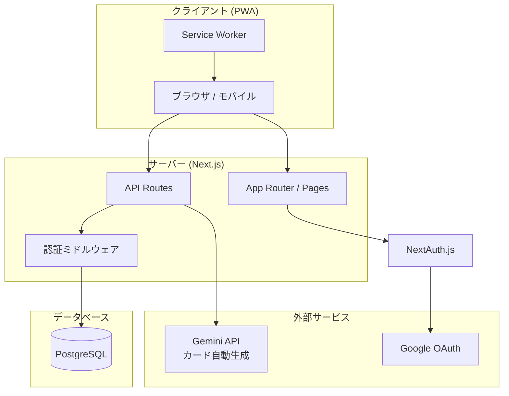
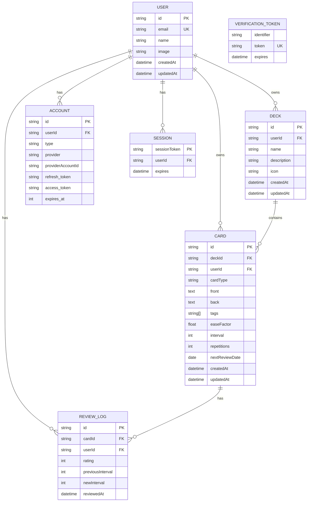
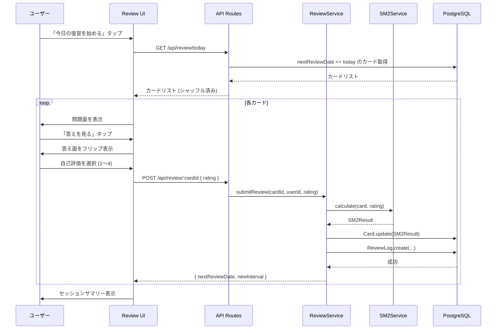
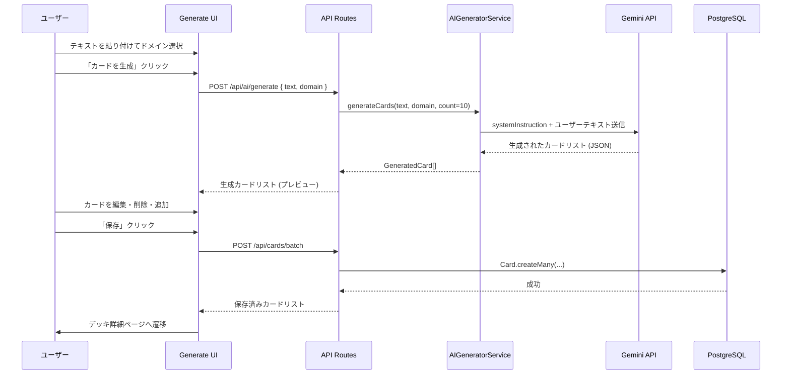
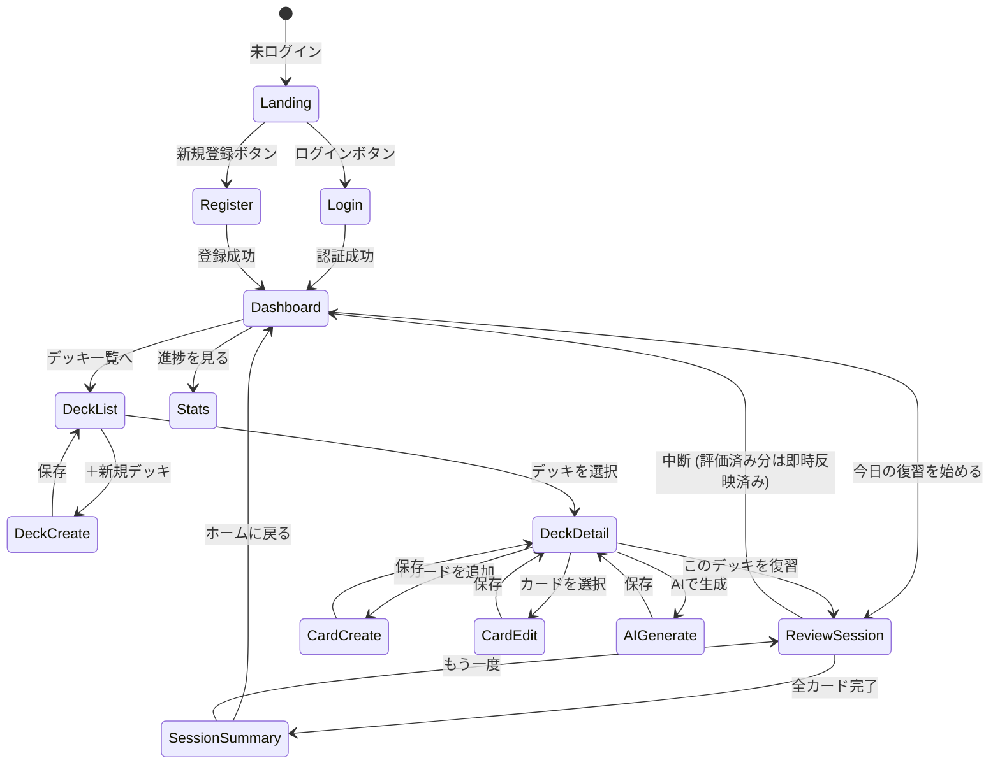

# 機能設計書 (Functional Design Document)

## システム構成図



## 技術スタック

| 分類 | 技術 | 選定理由 |
|------|------|----------|
| フレームワーク | Next.js 15 (App Router) | フルスタック対応・SSR/CSRの柔軟な使い分け・PWA対応 |
| 言語 | TypeScript | 型安全性・エンジニア向けプロダクトとして親和性が高い |
| UIライブラリ | React + Tailwind CSS | コンポーネント設計・レスポンシブ対応 |
| データベース | PostgreSQL (Supabase) | RLS対応・マルチユーザー・スケーラビリティ |
| ORM | Prisma | TypeScript親和性・マイグレーション管理 |
| 認証 | NextAuth.js | Google OAuth + メールパスワード認証に対応 |
| AI | Google Gemini API (2.0 Flash) | カード自動生成。無料枠(15RPM・100万トークン/日)でMVP規模をまかなえる |
| Markdown | react-markdown + remark-gfm | Markdownレンダリング |
| Mermaid | mermaid.js | ダイアグラム描画 |
| デプロイ | Vercel | Next.jsとの親和性・グローバルCDN |

---

## データモデル定義

### エンティティ: User

```typescript
interface User {
  id: string;            // UUID
  email: string;         // メールアドレス (unique)
  name: string;          // 表示名
  image?: string;        // プロフィール画像URL (OAuth由来)
  createdAt: Date;
  updatedAt: Date;
}
```

**制約**:
- `email` はシステム全体でユニーク
- パスワードはハッシュ化してDBに保存 (NextAuth.js が管理)

---

### エンティティ: Deck

```typescript
interface Deck {
  id: string;            // UUID
  userId: string;        // FK → User.id
  name: string;          // デッキ名 (1〜50文字)
  description?: string;  // 説明 (最大200文字)
  icon: string;          // 絵文字またはプリセットアイコンID (例: "📘" / "icon-code")
  createdAt: Date;
  updatedAt: Date;
}
```

**制約**:
- 1ユーザーあたり最大100デッキ
- `icon` は絵文字1文字またはシステム定義のアイコンID文字列

---

### エンティティ: Card

```typescript
type CardType = 'qa' | 'cloze' | 'code' | 'freewrite';

interface Card {
  id: string;              // UUID
  deckId: string;          // FK → Deck.id
  userId: string;          // FK → User.id
  cardType: CardType;      // カードタイプ
  front: string;           // 問題面 (Markdown / Mermaid対応)
  back: string;            // 答え面 (Markdown / Mermaid対応)
  tags: string[];          // タグリスト
  // SM-2パラメータ
  easeFactor: number;      // 難易度係数 (初期値: 2.5, 最小値: 1.3)
  interval: number;        // 次回復習までの日数 (初期値: 1)
  repetitions: number;     // 連続正解回数 (初期値: 0)
  nextReviewDate: Date;    // 次回復習予定日
  createdAt: Date;
  updatedAt: Date;
}
```

**カードタイプ別フォーマット**:
- `qa`: front=問題文, back=解答
- `cloze`: front=穴埋めテキスト `{{隠す単語}}` 記法, back=完全テキスト
- `code`: front=問題コード(コードブロック付きMarkdown), back=解答コード
- `freewrite`: front=テーマ/プロンプト, back=空(ユーザーが自由記述)
  - 自己評価の運用: 「答えを見る」ボタンを「記述できたか確認する」ボタンとして表示し、ユーザーが自分の記述と照合して4段階で評価する。SM-2の動作は他カードと同一

---

### エンティティ: ReviewLog

```typescript
type Rating = 1 | 2 | 3 | 4; // 1=全然わからない, 2=うっすら, 3=わかった, 4=完璧

interface ReviewLog {
  id: string;            // UUID
  cardId: string;        // FK → Card.id
  userId: string;        // FK → User.id
  rating: Rating;        // 自己評価
  previousInterval: number;  // 更新前のinterval
  newInterval: number;       // 更新後のinterval
  reviewedAt: Date;      // 復習実施日時
}
```

---

### ER図



> **注**: `ACCOUNT`・`SESSION`・`VERIFICATION_TOKEN` は NextAuth.js (Auth.js v5) の Database Adapter が自動管理するテーブル。アプリケーションコードから直接操作しない。

---

## コンポーネント設計

### フロントエンド: 主要コンポーネント

```
app/
├── page.tsx                    # ランディングページ (未ログイン時: サービス紹介・ログイン/新規登録ボタン)
├── (auth)/
│   ├── login/page.tsx          # ログイン画面
│   └── register/page.tsx       # 新規登録画面
├── (app)/
│   ├── dashboard/page.tsx      # ホーム・今日の復習
│   ├── decks/
│   │   ├── page.tsx            # デッキ一覧
│   │   ├── new/page.tsx        # デッキ作成
│   │   └── [deckId]/
│   │       ├── page.tsx        # デッキ詳細・カード一覧
│   │       └── edit/page.tsx   # デッキ編集
│   ├── cards/
│   │   ├── new/page.tsx        # カード作成
│   │   ├── [cardId]/edit/page.tsx  # カード編集
│   │   └── generate/page.tsx   # AI カード生成
│   ├── review/
│   │   ├── page.tsx            # 復習セッション
│   │   └── summary/page.tsx    # セッション終了サマリー
│   └── stats/page.tsx          # 学習進捗ダッシュボード
└── api/
    ├── auth/[...nextauth]/route.ts
    ├── decks/route.ts
    ├── decks/[deckId]/route.ts
    ├── cards/route.ts
    ├── cards/[cardId]/route.ts
    ├── review/today/route.ts
    ├── review/[cardId]/route.ts
    ├── ai/generate/route.ts
    └── stats/route.ts
```

### バックエンド: サービスレイヤー

```typescript
// DeckService
class DeckService {
  createDeck(userId: string, data: CreateDeckInput): Promise<Deck>;
  getDecksByUser(userId: string): Promise<DeckWithStats[]>;
  getDeckById(deckId: string, userId: string): Promise<DeckWithStats>;
  updateDeck(deckId: string, userId: string, data: UpdateDeckInput): Promise<Deck>;
  deleteDeck(deckId: string, userId: string): Promise<void>;
  // 削除ポリシー: デッキ削除時に配下の Card・ReviewLog を CASCADE DELETE する
  // (Prisma schema の onDelete: Cascade で設定。孤立レコードは残さない)
}

// CardService
class CardService {
  createCard(userId: string, data: CreateCardInput): Promise<Card>;
  getCardsByDeck(deckId: string, userId: string): Promise<Card[]>;
  updateCard(cardId: string, userId: string, data: UpdateCardInput): Promise<Card>;
  deleteCard(cardId: string, userId: string): Promise<void>;
  getTodayReviewCards(userId: string, deckId?: string): Promise<Card[]>;
}

// ReviewService
class ReviewService {
  submitReview(cardId: string, userId: string, rating: Rating): Promise<ReviewResult>;
  getSessionSummary(userId: string, sessionDate: Date): Promise<SessionSummary>;
}

// SM2Service
class SM2Service {
  calculate(card: Card, rating: Rating): SM2Result;
}

// AIGeneratorService
class AIGeneratorService {
  generateCards(text: string, domain: TechDomain, count: number): Promise<GeneratedCard[]>;
}

type TechDomain =
  | 'frontend'    // HTML/CSS/React/TypeScript
  | 'backend'     // Node.js/API設計/DB
  | 'infra'       // Docker/CI/CD/クラウド
  | 'algorithm'   // データ構造・アルゴリズム
  | 'os'          // OS・プロセス・メモリ管理
  | 'network'     // HTTP/TCP・セキュリティ
  | 'general';    // ドメイン横断・その他

// StatsService
class StatsService {
  getUserStats(userId: string): Promise<UserStats>;
  getHeatmapData(userId: string, days: number): Promise<HeatmapEntry[]>;
}
```

---

## アルゴリズム設計: SM-2 (間隔反復)

**目的**: ユーザーの自己評価に基づいて、各カードの次回復習日を最適化する

### 評価スケール

| Rating | ラベル | 意味 |
|--------|--------|------|
| 1 | 全然わからない | 完全に忘れていた |
| 2 | うっすら | 思い出せたが曖昧 |
| 3 | わかった | 少し考えてわかった |
| 4 | 完璧 | 即座に答えられた |

### 計算ロジック

#### Rating 1 (全然わからない): リセット
```
repetitions = 0
interval = 1
easeFactor = max(1.3, easeFactor - 0.20)
nextReviewDate = today + 1日
```

#### Rating 2 (うっすら): 間隔を短縮
```
repetitions = max(0, repetitions - 1)
interval = max(1, interval * 0.5)  // 間隔を半分に戻す
easeFactor = max(1.3, easeFactor - 0.15)
nextReviewDate = today + interval日
```

#### Rating 3 (わかった): 通常進行
```
if repetitions == 0: interval = 1
elif repetitions == 1: interval = 6
else: interval = round(interval * easeFactor)
repetitions += 1
nextReviewDate = today + interval日
```

#### Rating 4 (完璧): 加速進行
```
if repetitions == 0: interval = 1
elif repetitions == 1: interval = 6
else: interval = round(interval * easeFactor * 1.3)
repetitions += 1
easeFactor = min(2.5, easeFactor + 0.10)
nextReviewDate = today + interval日
```

### 習熟度分類

| 分類 | 条件 | 表示 |
|------|------|------|
| 未学習 | repetitions == 0 かつ reviewLog なし | グレー |
| 学習中 | interval < 21 日 | オレンジ |
| 習得済み | interval >= 21 日 | グリーン |

### 実装

```typescript
interface SM2Result {
  easeFactor: number;
  interval: number;
  repetitions: number;
  nextReviewDate: Date;
}

class SM2Service {
  calculate(card: Card, rating: Rating): SM2Result {
    let { easeFactor, interval, repetitions } = card;

    if (rating === 1) {
      repetitions = 0;
      interval = 1;
      easeFactor = Math.max(1.3, easeFactor - 0.20);
    } else if (rating === 2) {
      repetitions = Math.max(0, repetitions - 1);
      interval = Math.max(1, Math.round(interval * 0.5));
      easeFactor = Math.max(1.3, easeFactor - 0.15);
    } else if (rating === 3) {
      if (repetitions === 0) interval = 1;
      else if (repetitions === 1) interval = 6;
      else interval = Math.round(interval * easeFactor);
      repetitions += 1;
    } else { // rating === 4
      if (repetitions === 0) interval = 1;
      else if (repetitions === 1) interval = 6;
      else interval = Math.round(interval * easeFactor * 1.3);
      repetitions += 1;
      easeFactor = Math.min(2.5, easeFactor + 0.10);
    }

    const nextReviewDate = new Date();
    nextReviewDate.setDate(nextReviewDate.getDate() + interval);

    return { easeFactor, interval, repetitions, nextReviewDate };
  }
}
```

---

## ユースケース図

### 1. 復習セッションのフロー



**セッション中断時の仕様**:
- 自己評価を送信した時点でカードごとに **即時** SM-2更新・ReviewLog 作成・DB反映を行う
- セッションを中断してもそれまでの評価結果は保持され、失われない
- 再開は「今日の復習を始める」から同じカードセットを再取得する。中断前に評価済みのカードは `nextReviewDate` が更新済みのため出題されない

### 2. AI カード自動生成のフロー



---

## 画面遷移図



---

## AI カード生成 プロンプト設計

### システムプロンプト

```
あなたは教育カード生成の専門家です。
ユーザーが提供したテキストから、間隔反復学習に最適なフラッシュカードを生成してください。

## 出力ルール
- 必ず以下のJSON配列形式のみで出力する（コードブロック・説明文は不要）
- 各カードは "front"（問題）と "back"（答え）の2フィールドを持つ
- frontは疑問形または穴埋め形式で記述する
- backは簡潔かつ正確に記述する（1〜3文が目安）
- 重複・冗長なカードは生成しない
- 指定された件数を厳守する

## ドメイン調整
ドメインに応じて問題の観点を調整する:
- frontend: UI/UXの仕様・ブラウザ挙動・フレームワークのAPIに焦点
- backend: データ設計・APIの設計パターン・パフォーマンスに焦点
- infra: コマンド・設定値・構成の理由に焦点
- algorithm: 計算量・データ構造の選択理由・実装パターンに焦点
- os: プロセス・メモリ・システムコールの動作に焦点
- network: プロトコルの仕様・セキュリティの考え方に焦点
- general: 概念の定義・因果関係・比較に焦点
```

### 出力 JSON スキーマ

```json
[
  {
    "front": "TypeScriptにおけるジェネリクスの主な目的は何ですか？",
    "back": "型をパラメータとして受け取ることで、型安全性を保ちながら再利用可能な関数・クラスを実現するため。"
  },
  {
    "front": "Array<T> と T[] の違いは何ですか？",
    "back": "記述方法が異なるだけで意味は同じ。ただし T[] は複合型（(string | number)[]）で読みにくくなるため、Array<string | number> が推奨される。"
  }
]
```

### ユーザーメッセージ構成

```
ドメイン: {domain}
生成件数: {count}件

---
{text}
```

### バリデーション

| 項目 | 制約 |
|------|------|
| `text` 文字数 | 最小50文字・最大5,000文字 |
| `count` | 最小5件・最大10件 |
| `domain` | `TechDomain` の列挙値のみ |
| タイムアウト | 30秒（Vercel `maxDuration: 60` を設定） |

---

## API設計

### デッキ

#### `GET /api/decks`
ログインユーザーのデッキ一覧を返す。カーソルページネーション (20件/ページ)。

**クエリパラメータ**: `?cursor=<lastDeckId>`

**レスポンス**:
```json
{
  "decks": [
    {
      "id": "uuid",
      "name": "TypeScript基礎",
      "description": "TypeScriptの型システムを学ぶ",
      "icon": "📘",
      "cardCount": 42,
      "todayReviewCount": 5,
      "createdAt": "2026-04-01T00:00:00Z"
    }
  ],
  "nextCursor": "uuid-of-last-item",
  "hasMore": true
}
```

#### `POST /api/decks`
**リクエスト**:
```json
{ "name": "TypeScript基礎", "description": "...", "icon": "📘" }
```

**レスポンス** (201):
```json
{ "id": "uuid", "name": "TypeScript基礎", "description": "...", "icon": "📘", "createdAt": "2026-04-01T00:00:00Z" }
```

**エラー**:
- 400: nameが空 / 文字数超過
- 401: 未認証

---

#### `GET /api/decks/:deckId`
指定したデッキの詳細情報をカード枚数・習熟度統計付きで返す。

**レスポンス**:
```json
{
  "id": "uuid",
  "name": "TypeScript基礎",
  "description": "TypeScriptの型システムを学ぶ",
  "icon": "📘",
  "cardCount": 42,
  "todayReviewCount": 5,
  "masteryDistribution": {
    "unlearned": 10,
    "learning": 25,
    "mastered": 7
  },
  "createdAt": "2026-04-01T00:00:00Z",
  "updatedAt": "2026-04-14T00:00:00Z"
}
```

**エラー**:
- 401: 未認証
- 404: デッキが存在しない、または他ユーザーのデッキ

---

#### `PUT /api/decks/:deckId`
デッキの名前・説明・アイコンを更新する。

**リクエスト**:
```json
{ "name": "TypeScript応用", "description": "...", "icon": "📗" }
```

**レスポンス** (200):
```json
{ "id": "uuid", "name": "TypeScript応用", "description": "...", "icon": "📗", "updatedAt": "2026-04-14T00:00:00Z" }
```

**エラー**:
- 400: nameが空 / 文字数超過
- 401: 未認証
- 404: デッキが存在しない、または他ユーザーのデッキ

---

#### `DELETE /api/decks/:deckId`
デッキを削除する。配下のカードと復習ログもCASCADE DELETEされる。

**レスポンス** (204): ボディなし

**エラー**:
- 401: 未認証
- 404: デッキが存在しない、または他ユーザーのデッキ

---

#### `GET /api/cards`
デッキに属するカード一覧を返す。カーソルページネーション (20件/ページ)。

**クエリパラメータ**:
- `deckId` (必須): 取得対象のデッキID
- `cursor`: ページネーション用カーソル (前ページ最後のカードID)

**レスポンス**:
```json
{
  "cards": [
    {
      "id": "uuid",
      "deckId": "uuid",
      "cardType": "qa",
      "front": "TypeScriptのジェネリクスとは？",
      "back": "型をパラメータとして受け取る仕組み",
      "tags": ["typescript", "generics"],
      "easeFactor": 2.5,
      "interval": 6,
      "repetitions": 2,
      "nextReviewDate": "2026-04-20T00:00:00Z",
      "createdAt": "2026-04-01T00:00:00Z"
    }
  ],
  "nextCursor": "uuid-of-last-item",
  "hasMore": true
}
```

**エラー**:
- 400: `deckId` が指定されていない
- 401: 未認証
- 404: デッキが存在しない、または他ユーザーのデッキ

---

#### `POST /api/cards`
カードを作成する。

**リクエスト**:
```json
{
  "deckId": "uuid",
  "cardType": "qa",
  "front": "TypeScriptのジェネリクスとは？",
  "back": "型をパラメータとして受け取る仕組み",
  "tags": ["typescript", "generics"]
}
```

**レスポンス** (201):
```json
{ "id": "uuid", "deckId": "uuid", "cardType": "qa", "front": "...", "back": "...", "tags": ["typescript"], "createdAt": "2026-04-14T00:00:00Z" }
```

**エラー**:
- 400: 必須フィールド不足 / front文字数超過(2000字) / タグ数超過(10個) / タグ長超過(50文字)
- 401: 未認証
- 404: deckIdが存在しない、または他ユーザーのデッキ

---

#### `PUT /api/cards/:cardId`
カードの内容を更新する。

**リクエスト**:
```json
{ "front": "更新後の問題文", "back": "更新後の答え", "tags": ["typescript"] }
```

**レスポンス** (200):
```json
{ "id": "uuid", "front": "更新後の問題文", "back": "更新後の答え", "tags": ["typescript"], "updatedAt": "2026-04-14T00:00:00Z" }
```

**エラー**:
- 400: 文字数超過 / タグ数超過
- 401: 未認証
- 404: カードが存在しない、または他ユーザーのカード

---

#### `GET /api/cards/:cardId`
指定したカードの詳細情報を返す。カード編集画面の初期データ取得に使用。

**レスポンス**:
```json
{
  "id": "uuid",
  "deckId": "uuid",
  "cardType": "qa",
  "front": "TypeScriptのジェネリクスとは？",
  "back": "型をパラメータとして受け取る仕組み",
  "tags": ["typescript", "generics"],
  "easeFactor": 2.5,
  "interval": 6,
  "repetitions": 2,
  "nextReviewDate": "2026-04-20T00:00:00Z",
  "createdAt": "2026-04-01T00:00:00Z",
  "updatedAt": "2026-04-14T00:00:00Z"
}
```

**エラー**:
- 401: 未認証
- 404: カードが存在しない、または他ユーザーのカード

---

#### `DELETE /api/cards/:cardId`
カードを削除する。紐づく復習ログもCASCADE DELETEされる。

**レスポンス** (204): ボディなし

**エラー**:
- 401: 未認証
- 404: カードが存在しない、または他ユーザーのカード

---

#### `POST /api/cards/batch`
AI生成カードを一括保存する。`POST /api/ai/generate` で生成したカードをまとめて保存する用途。

**リクエスト**:
```json
{
  "deckId": "uuid",
  "cards": [
    { "cardType": "qa", "front": "ジェネリクスの目的は？", "back": "型の再利用性を高めること", "tags": ["typescript"] },
    { "cardType": "qa", "front": "Array<T> と T[] の違いは？", "back": "記述方法のみ異なり意味は同じ", "tags": ["typescript"] }
  ]
}
```

**レスポンス** (201):
```json
{
  "created": 2,
  "cards": [
    { "id": "uuid", "deckId": "uuid", "cardType": "qa", "front": "...", "back": "...", "tags": ["typescript"], "createdAt": "2026-04-14T00:00:00Z" }
  ]
}
```

**制約**:
- 一度に保存できるカード数: 最大10件（AI生成の `count` 上限と一致）
- 各カードのバリデーションは `POST /api/cards` と同一 (front/back 各2000字以内、タグ10個以内)

**エラー**:
- 400: `cards` が空 / 上限超過 / 個別カードのバリデーションエラー
- 401: 未認証
- 404: `deckId` が存在しない、または他ユーザーのデッキ

---

#### `GET /api/review/today`
本日復習予定のカードを返す。`deckId` クエリパラメータで絞り込み可能。

**クエリパラメータ**:
- `deckId` (任意): 指定したデッキのカードのみを返す

**レスポンス**:
```json
{
  "cards": [
    {
      "id": "uuid",
      "cardType": "qa",
      "front": "TypeScriptのジェネリクスとは？",
      "back": "型をパラメータとして受け取る...",
      "deckId": "uuid",
      "deckName": "TypeScript基礎"
    }
  ],
  "total": 12
}
```

**エラー**:
- 401: 未認証

---

#### `POST /api/review/:cardId`
復習結果を送信してSM-2スケジュールを更新する。

**リクエスト**:
```json
{ "rating": 3 }
```

**レスポンス**:
```json
{
  "cardId": "uuid",
  "newInterval": 6,
  "nextReviewDate": "2026-04-20T00:00:00Z"
}
```

**エラー**:
- 400: `rating` が 1〜4 の整数以外
- 401: 未認証
- 404: カードが存在しない、または他ユーザーのカード

---

#### `POST /api/ai/generate`
テキストからカードを自動生成する。

**リクエスト**:
```json
{
  "text": "TypeScriptのジェネリクスは...(書籍のテキスト)",
  "domain": "frontend",
  "count": 10
}
```

**レスポンス**:
```json
{
  "cards": [
    { "front": "ジェネリクスの目的は？", "back": "型の再利用性を高めること" }
  ]
}
```

**エラー**:
- 400: textが空 / 文字数が5000字超
- 401: 未認証
- 429: API呼び出し制限超過
- 504: Gemini API タイムアウト (30秒)

---

#### `GET /api/stats`
ログインユーザーの学習統計を返す。ダッシュボード表示に使用する。

**クエリパラメータ**:
- `days` (任意, デフォルト: 30): ヒートマップの対象日数

**レスポンス**:
```json
{
  "totalCards": 120,
  "masteryDistribution": {
    "unlearned": 30,
    "learning": 60,
    "mastered": 30
  },
  "currentStreak": 14,
  "todayReviewCount": 8,
  "weeklyCompletionRate": 0.85,
  "heatmap": [
    { "date": "2026-04-14", "count": 8 },
    { "date": "2026-04-13", "count": 5 }
  ]
}
```

**エラー**:
- 401: 未認証

---

## UI設計

### カードフリップ

**問題面**:
```
┌─────────────────────────────────┐
│  📘 TypeScript基礎   3 / 12    │
│                                 │
│  TypeScriptのジェネリクスとは？  │
│  (問題文 / Markdown描画)        │
│                                 │
│         [ 答えを見る ]          │
└─────────────────────────────────┘
```

**答え面(フリップ後)**:
```
┌─────────────────────────────────┐
│  📘 TypeScript基礎   3 / 12    │
│  ─────────────────────────────  │
│  型をパラメータとして受け取る    │
│  仕組み。再利用可能な型安全な    │
│  関数・クラスを実現する。        │
│                                 │
│  [ 😵 忘れた ] [ 🤔 うっすら ]  │
│  [ 😊 わかった ] [ 🎯 完璧 ]   │
└─────────────────────────────────┘
```

### 習熟度の色分け

| 状態 | 色 | 条件 |
|------|------|------|
| 未学習 | グレー (#9CA3AF) | 一度も復習していない |
| 学習中 | オレンジ (#F59E0B) | interval < 21日 |
| 習得済み | グリーン (#10B981) | interval >= 21日 |

### ストリーク表示

```
🔥 連続学習: 14日
```

---

## パフォーマンス最適化

- **復習カードのプリフェッチ**: セッション開始時に全カードを一括取得しクライアントにキャッシュ (ラウンドトリップ削減)
- **Mermaidの遅延ロード**: 動的インポートでバンドルサイズ削減
- **画像なし方針**: デッキに画像を持たせないことでストレージ・CDN負荷をゼロにする
- **DB インデックス**: `Card(userId, nextReviewDate)` に複合インデックスを設定

---

## セキュリティ考慮事項

- **Row Level Security (RLS)**: Supabase PostgreSQLのRLSポリシーにより、`userId` が一致するレコードのみ操作可能
- **API Route 認証**: 全APIルートでNextAuth.jsのセッション検証を実施
- **Gemini API キー**: サーバーサイドの環境変数に限定し、クライアントに露出させない
- **入力サニタイズ**: Markdownレンダリング時はreact-markdownの `rehype-sanitize` を使用してXSS防止

---

## エラーハンドリング

| エラー種別 | HTTPステータス | ユーザー向け表示 |
|-----------|--------------|-----------------|
| 未認証 | 401 | ログイン画面へリダイレクト |
| 権限なし | 403 | 「このリソースへのアクセス権がありません」 |
| リソース不在 | 404 | 「カード/デッキが見つかりません」 |
| バリデーションエラー | 400 | フィールド横にエラーメッセージ表示 |
| AI生成タイムアウト | 504 | 「生成に時間がかかっています。もう一度試してください」 |
| サーバーエラー | 500 | 「予期せぬエラーが発生しました。しばらく後にお試しください」 |

---

## テスト戦略

### ユニットテスト
- `SM2Service.calculate()`: 全4パターンのrating × 複数repetitions状態の組み合わせ
- バリデーション関数: カードタイプ別の入力検証
- `StatsService`: ヒートマップデータ・習熟度分布の計算ロジック

### 統合テスト
- APIルート: 認証あり/なし・正常系/異常系の各エンドポイント
- DB操作: Deck/Card/ReviewLogのCRUD・RLSポリシーの動作確認

### E2Eテスト (Playwright)
- 新規ユーザーがデッキ作成 → カード作成 → 復習セッション完了までの主要フロー
- AIカード生成 → 編集 → 保存フロー
- モバイルビューポート(375px)でのタップ操作
