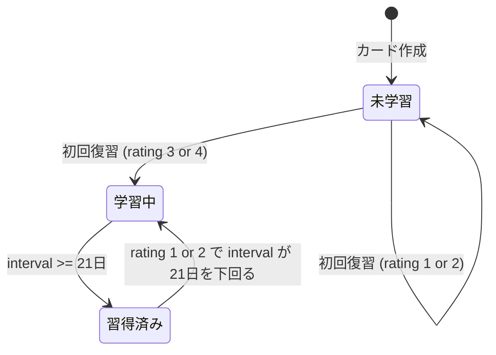

# プロジェクト用語集 (Glossary)

## 概要

このドキュメントは、loop-learn プロジェクト内で使用される用語の定義を管理します。

**更新日**: 2026-04-14

---

## ドメイン用語

### アクティブリコール (Active Recall)

**定義**: 記憶を「取り出す」練習を繰り返すことで長期記憶を強化する学習法。

**説明**: 単に情報を読み返す(パッシブリーディング)のではなく、記憶から能動的に情報を引き出す練習をすることで、記憶の定着率を高める。loop-learnでは復習セッションでのカードフリップがこれに相当する。

**関連用語**: [間隔反復](#間隔反復-spaced-repetition)、[復習セッション](#復習セッション-review-session)

**英語表記**: Active Recall

---

### 間隔反復 (Spaced Repetition)

**定義**: 学習内容を「忘れかけたタイミング」で復習することで、最小の努力で最大の記憶定着を実現する学習法。

**説明**: ドイツの心理学者エビングハウスが発見した「忘却曲線」に基づく。同じ内容を短い間隔で何度も復習するより、忘れかけたタイミングで復習する方が記憶に定着しやすい。loop-learnでは [SM-2アルゴリズム](#sm-2アルゴリズム) を使って各カードの最適な復習日を自動計算する。

**関連用語**: [SM-2アルゴリズム](#sm-2アルゴリズム)、[次回復習日](#次回復習日-next-review-date)

**英語表記**: Spaced Repetition

---

### カード (Card)

**定義**: 学習コンテンツの最小単位。問題面(front)と答え面(back)を持つ。

**説明**: 1枚のカードが1つの知識を表す。カードタイプとして `qa`・`cloze`・`code`・`freewrite` の4種類がある。各カードはSM-2のパラメータ(easeFactor・interval・repetitions)を持ち、学習状況に応じて個別にスケジューリングされる。

**関連用語**: [カードタイプ](#カードタイプ-card-type)、[デッキ](#デッキ-deck)、[SM-2アルゴリズム](#sm-2アルゴリズム)

**データモデル**: `src/types/card.ts`

**英語表記**: Card

---

### カードタイプ (Card Type)

**定義**: カードの入力・表示形式を分類する列挙型。

**値の定義**:

| 値 | 名称 | 説明 |
|----|------|------|
| `qa` | Q&A形式 | 問題文と解答のシンプルなフラッシュカード |
| `cloze` | 穴埋め形式 | `{{キーワード}}` 記法でテキスト中の語を隠す |
| `code` | コード形式 | コードブロック付きのプログラミング問題 |
| `freewrite` | 自由記述形式 | ファインマンテクニック・白紙勉強法に対応。答え面は空欄でユーザーが自由記述 |

**実装**: `src/types/card.ts`

```typescript
type CardType = 'qa' | 'cloze' | 'code' | 'freewrite';
```

---

### デッキ (Deck)

**定義**: カードをテーマ・技術領域別にまとめたグループ。

**説明**: エンジニアが学習領域(例: TypeScript基礎・ネットワーク・OS)ごとにカードを整理する単位。ユーザーが保有するカードの合計は最大5,000枚。アイコン(絵文字またはプリセット)で識別しやすくする。

**関連用語**: [カード](#カード-card)

**データモデル**: `src/types/deck.ts`

**英語表記**: Deck

---

### 復習セッション (Review Session)

**定義**: 本日復習予定のカードを順番にめくり、自己評価を入力する一連の学習体験。

**説明**: セッション開始時に `nextReviewDate <= today` のカードが取得され、1枚ずつフリップ形式で出題される。ユーザーが自己評価(1〜4)を選択すると SM-2アルゴリズムにより次回復習日が更新される。セッション終了時にサマリーが表示される。

**関連用語**: [自己評価](#自己評価-rating)、[SM-2アルゴリズム](#sm-2アルゴリズム)、[次回復習日](#次回復習日-next-review-date)

**実装**: `src/lib/services/review.ts`

**英語表記**: Review Session

---

### 自己評価 (Rating)

**定義**: 復習セッション中にユーザーがカードの記憶度を4段階で評価する入力。

**値の定義**:

| 値 | ラベル | 意味 | SM-2への影響 |
|----|--------|------|-------------|
| `1` | 全然わからない | 完全に忘れていた | リセット (interval=1, repetitions=0) |
| `2` | うっすら | 思い出せたが曖昧 | 間隔を短縮、easeFactor減少 |
| `3` | わかった | 少し考えてわかった | 通常進行 |
| `4` | 完璧 | 即座に答えられた | 加速進行、easeFactor増加 |

**実装**:
```typescript
type Rating = 1 | 2 | 3 | 4;
```

---

### 次回復習日 (Next Review Date)

**定義**: SM-2アルゴリズムが計算した、そのカードを次に復習すべき日付。

**説明**: `Card.nextReviewDate` フィールドに保存される。`nextReviewDate <= today` のカードが「本日の復習予定」としてダッシュボードに表示される。

**関連用語**: [SM-2アルゴリズム](#sm-2アルゴリズム)、[間隔 (Interval)](#間隔-interval)

---

### 習熟度 (Mastery Level)

**定義**: カードの学習状況を3段階で分類した指標。

| 分類 | 条件 | 表示色 |
|------|------|-------|
| 未学習 | `repetitions == 0` かつ復習ログなし | グレー |
| 学習中 | `interval < 21日` | オレンジ |
| 習得済み | `interval >= 21日` | グリーン |

---

### ストリーク (Streak)

**定義**: 連続して学習した日数。

**説明**: 復習セッション中に **1枚以上のカードを評価した日** を「学習した日」とカウントする。セッションを最後まで完了しなくても記録される。ダッシュボードに 🔥 アイコンと日数で表示。学習モチベーションの維持を目的とする。

**達成条件**: その日(JST 0:00〜23:59)に `ReviewLog` が1件以上作成されていること。

**リセット条件**: 前日の `ReviewLog` が0件だった場合、ストリークは翌日0にリセットされる。

---

### ヒートマップ (Heatmap)

**定義**: 過去30日間の学習実績をカレンダー形式で色の濃淡で表現したグラフ。

**説明**: 1日の復習枚数が多いほど色が濃くなる。GitHubのコントリビューショングラフに類似した表示。学習の継続状況を一目で把握できる。

---

### 精緻的質問 (Elaborative Interrogation)

**定義**: 学んだ事実に対して「なぜ？」「どうして？」と自問し、自分なりの説明を作ることで理解と記憶を深める学習法。

**説明**: loop-learnでは Post-MVP 機能として、カード表示時に「この概念が重要な理由を説明してみよう」などのプロンプトを提示する「精緻的質問モード」として実装予定。

**優先度**: P1 (Post-MVP)

**英語表記**: Elaborative Interrogation

---

### インターリービング (Interleaving)

**定義**: 複数の異なるトピックや問題タイプを混ぜて練習する学習法。

**説明**: 同じデッキだけを集中的に復習するより、複数デッキを横断して出題することで知識の応用力を高める。loop-learnでは Post-MVP 機能「インターリービング学習モード」として実装予定。

**優先度**: P1 (Post-MVP)

**英語表記**: Interleaving

---

### コーネルメソッドノート連携 (Cornell Method Integration)

**定義**: コーネル形式のノートを入力として、キーワード欄・サマリー欄からカードを自動生成する機能。

**説明**: コーネルメソッドはノートを「ノートエリア(記録)」「キューエリア(キーワード)」「サマリーエリア(要約)」の3分割で構成する。loop-learn では Post-MVP 機能として、このフォーマットで入力されたテキストから各エリアを解析してカードを生成する。

**優先度**: P1 (Post-MVP)

**英語表記**: Cornell Method Integration

---

### コードチャレンジ (Code Challenge)

**定義**: コード穴埋め問題で、実際にエディタに入力して解答を検証するインタラクティブ形式のカードタイプ。

**説明**: 通常の `code` カードタイプがコードを「表示して確認する」のに対し、コードチャレンジはユーザーが実際にコードを入力し、正誤を自動判定する。loop-learn では Post-MVP 機能として実装予定。

**優先度**: P2 (Post-MVP)

**英語表記**: Code Challenge

---

## 技術用語

### TechDomain

**定義**: AIカード自動生成機能で問題の観点を調整するために指定する技術ドメインの列挙型。

**値の定義**:

| 値 | 対象領域 |
|----|---------|
| `frontend` | HTML/CSS/React/TypeScript/ブラウザ挙動 |
| `backend` | Node.js/API設計/データベース設計 |
| `infra` | Docker/CI・CD/クラウドインフラ |
| `algorithm` | データ構造・アルゴリズム・計算量 |
| `os` | OS・プロセス・メモリ管理・システムコール |
| `network` | HTTP/TCP・セキュリティ・プロトコル |
| `general` | ドメイン横断・概念定義・比較 |

**実装**:
```typescript
// src/types/card.ts
type TechDomain =
  | 'frontend' | 'backend' | 'infra'
  | 'algorithm' | 'os' | 'network' | 'general';
```

**実装箇所**: `src/lib/services/aiGenerator.ts`、`src/app/api/ai/generate/route.ts`

---

### SM-2アルゴリズム

**定義**: SuperMemo社が開発した間隔反復アルゴリズム。自己評価に基づいて次回復習日を計算する。

**本プロジェクトでの用途**: 各カードの `easeFactor`・`interval`・`repetitions` を更新し `nextReviewDate` を計算する。

**主要パラメータ**:

| パラメータ | 説明 | 初期値 | 範囲 |
|-----------|------|-------|------|
| `easeFactor` | 難易度係数。高いほど次回の間隔が長くなる | 2.5 | 1.3〜2.5 |
| `interval` | 次回復習までの日数 | 1 | 1〜∞ |
| `repetitions` | 連続正解回数 | 0 | 0〜∞ |

**実装箇所**: `src/lib/services/sm2.ts`

**参考ドキュメント**: [機能設計書 - SM-2アルゴリズム設計](./functional-design.md#アルゴリズム設計-sm-2-間隔反復)

---

### 間隔 (Interval)

**定義**: SM-2の `Card.interval` フィールド。次回復習まで何日空けるかを表す整数値。

**説明**: Rating 3・4で正解を重ねるほど間隔が指数的に伸びる。間隔が21日以上になると「習得済み」に分類される。

---

### Next.js App Router

**定義**: Next.js 13以降で導入されたファイルベースのルーティングシステム。React Server Components(RSC)を活用する。

**本プロジェクトでの用途**: 全ページ・APIルートの定義。`src/app/` 以下に配置。RSCでのSSRとClientコンポーネントを使い分ける。

**バージョン**: 15.x

**関連ドキュメント**: [アーキテクチャ設計書](./architecture.md)

---

### Prisma

**定義**: TypeScript向けの型安全なORMおよびデータベースツールキット。

**本プロジェクトでの用途**: PostgreSQL(Supabase)へのアクセス。`schema.prisma` でスキーマを定義し、マイグレーションを管理する。`src/lib/prisma.ts` でシングルトンクライアントを提供。

**バージョン**: 6.x

**設定ファイル**: `prisma/schema.prisma`

---

### Supabase

**定義**: PostgreSQLをベースにしたオープンソースのBaaSプラットフォーム。

**本プロジェクトでの用途**: メインデータベース。Row Level Security(RLS)ポリシーによりユーザーごとのデータ分離を実現する。

**関連ドキュメント**: [アーキテクチャ設計書](./architecture.md)

---

### RLS (Row Level Security)

**正式名称**: Row Level Security

**意味**: PostgreSQLの機能。テーブルの行単位でアクセス制御ポリシーを定義できる。

**本プロジェクトでの使用**: Supabaseで `userId = auth.uid()` ポリシーを設定し、ログインユーザーが自分のデータのみ読み書きできるようにする。

---

### NextAuth.js (Auth.js)

**定義**: Next.js向けの認証ライブラリ。OAuth・メールパスワード認証に対応。

**本プロジェクトでの用途**: ユーザー認証。Googleソーシャルログインとメール/パスワード認証を提供。`src/lib/auth.ts` で設定。

**バージョン**: 5.x (Auth.js)

---

### Zod

**定義**: TypeScript向けのスキーマバリデーションライブラリ。

**本プロジェクトでの用途**: APIルートのリクエストボディバリデーション。`src/lib/validations/` にスキーマを定義し、型推論も兼用する。

**バージョン**: 3.x

---

### Mermaid

**定義**: テキストベースでダイアグラムを生成するツール。フローチャート・シーケンス図・ER図などを描画できる。

**本プロジェクトでの用途**: カードのコンテンツとして Mermaid 記法を埋め込み可能。アーキテクチャ図・シーケンス図を含む学習カードを作成できる。

**バージョン**: 11.x

---

### Gemini API

**定義**: Google が提供するLLM(大規模言語モデル)API。Gemini 2.0 Flash を使用。

**本プロジェクトでの用途**: AI問題自動生成機能。テキストブロックを入力するとQ&Aカードを自動生成する。`src/lib/services/aiGenerator.ts` で使用。サーバーサイドのみでアクセスし、APIキーはクライアントに露出しない。

**無料枠**: 15リクエスト/分・100万トークン/日。MVP規模では無料枠内で運用可能。

**SDK**: `@google/generative-ai`

**環境変数**: `GEMINI_API_KEY`

---

### DeckWithStats

**定義**: デッキの基本情報に加え、カード枚数・本日の復習予定枚数を付加した複合型。

**実装**: `src/types/deck.ts`

```typescript
interface DeckWithStats extends Deck {
  cardCount: number;         // デッキ内の総カード枚数
  todayReviewCount: number;  // 本日の復習予定カード枚数
}
```

**使用箇所**: `DeckService.getDecksByUser()` の戻り値。デッキ一覧画面で使用。

---

### SM2Result

**定義**: SM-2アルゴリズムの計算結果を格納する型。カードに適用してDBを更新する。

**実装**: `src/types/review.ts`

```typescript
interface SM2Result {
  easeFactor: number;      // 更新後の難易度係数
  interval: number;        // 更新後の次回復習間隔 (日数)
  repetitions: number;     // 更新後の連続正解回数
  nextReviewDate: Date;    // 次回復習予定日
}
```

**使用箇所**: `SM2Service.calculate()` の戻り値。`ReviewService.submitReview()` から呼ばれる。

---

### SessionSummary

**定義**: 復習セッション終了時に表示する成果サマリーの型。

**実装**: `src/types/review.ts`

```typescript
interface SessionSummary {
  reviewedCount: number;        // 本セッションで復習したカード枚数
  averageRating: number;        // 平均自己評価 (1.0〜4.0)
  currentStreak: number;        // 現在の連続学習日数
  masteredCount: number;        // 習得済み (interval >= 21日) に達したカード枚数
}
```

**使用箇所**: `ReviewService.getSessionSummary()` の戻り値。復習セッション終了サマリー画面で使用。

---

### UserStats

**定義**: ダッシュボード表示に必要なユーザーの学習統計全体を格納する型。

**実装**: `src/types/stats.ts`

```typescript
interface UserStats {
  totalCards: number;
  masteryDistribution: {
    unlearned: number;
    learning: number;
    mastered: number;
  };
  currentStreak: number;
  todayReviewCount: number;
  weeklyCompletionRate: number;  // 0.0〜1.0
  heatmap: HeatmapEntry[];
}
```

**使用箇所**: `StatsService.getUserStats()` の戻り値。`GET /api/stats` レスポンスの元データ。

---

### HeatmapEntry

**定義**: ヒートマップ表示のための1日分の学習記録を格納する型。

**実装**: `src/types/stats.ts`

```typescript
interface HeatmapEntry {
  date: string;   // "YYYY-MM-DD" 形式 (JST基準)
  count: number;  // その日に復習したカード枚数
}
```

**使用箇所**: `StatsService.getHeatmapData()` の戻り値。`HeatmapCalendar` コンポーネントで使用。

---

### GeneratedCard

**定義**: AIカード生成機能が返す未保存カードの型。ユーザーが編集・確認してから保存する。

**実装**: `src/types/card.ts`

```typescript
interface GeneratedCard {
  front: string;   // 生成された問題文
  back: string;    // 生成された答え
}
```

**使用箇所**: `AIGeneratorService.generateCards()` の戻り値。`POST /api/cards/batch` で保存する前の一時データ。

---

### DeckService

**定義**: デッキのCRUD操作を担当するサービスクラス。

**実装**: `src/lib/services/deck.ts`

**主なメソッド**:
- `createDeck(userId, data)` → `Deck`
- `getDecksByUser(userId)` → `DeckWithStats[]`
- `getDeckById(deckId, userId)` → `DeckWithStats`
- `updateDeck(deckId, userId, data)` → `Deck`
- `deleteDeck(deckId, userId)` → デッキ・Card・ReviewLog を CASCADE DELETE

---

### CardService

**定義**: カードのCRUD操作と復習対象カードの取得を担当するサービスクラス。

**実装**: `src/lib/services/card.ts`

**主なメソッド**:
- `createCard(userId, data)` → `Card`
- `getCardsByDeck(deckId, userId)` → `Card[]`
- `updateCard(cardId, userId, data)` → `Card`
- `deleteCard(cardId, userId)` → ReviewLog を CASCADE DELETE
- `getTodayReviewCards(userId, deckId?)` → `Card[]`

---

### ReviewService

**定義**: 復習セッションのロジック（SM-2更新・ReviewLog記録・サマリー生成）を担当するサービスクラス。

**実装**: `src/lib/services/review.ts`

**主なメソッド**:
- `submitReview(cardId, userId, rating)` → `{ nextReviewDate, newInterval }`
- `getSessionSummary(userId, sessionDate)` → `SessionSummary`

---

### StatsService

**定義**: ユーザーの学習統計（ヒートマップ・習熟度分布・ストリーク）を集計するサービスクラス。

**実装**: `src/lib/services/stats.ts`

**主なメソッド**:
- `getUserStats(userId)` → `UserStats`
- `getHeatmapData(userId, days)` → `HeatmapEntry[]`

---

### AIGeneratorService

**定義**: Gemini APIと連携してテキストからQ&Aカードを自動生成するサービスクラス。

**実装**: `src/lib/services/aiGenerator.ts`

**主なメソッド**:
- `generateCards(text, domain, count)` → `GeneratedCard[]`

**注意**: APIキー (`GEMINI_API_KEY`) はサーバーサイドのみで使用。クライアントに露出しない。

---

## 略語・頭字語

### PWA

**正式名称**: Progressive Web Application

**意味**: Webブラウザで動作しながらネイティブアプリに近い体験を提供するWebアプリの形態。

**本プロジェクトでの使用**: モバイル対応のアプローチ。ネイティブアプリを開発せず、`public/manifest.json` を用意することでホーム画面への追加・フルスクリーン表示に対応する。

---

### RSC

**正式名称**: React Server Components

**意味**: サーバーサイドでレンダリングされるReactコンポーネント。クライアントにJavaScriptを送らないため軽量。

**本プロジェクトでの使用**: Next.js App Routerにおいて `page.tsx` などのデフォルトコンポーネントはRSC。DBアクセスやAPIコールをコンポーネント内で直接実行できる。

---

### SM-2

**正式名称**: SuperMemo 2 (Algorithm SM-2)

**意味**: SuperMemo社が1987年に発表した間隔反復アルゴリズム。AnkiなどのSRS(間隔反復システム)で広く採用されている。

**本プロジェクトでの使用**: 全カードの復習スケジューリングに採用。`src/lib/services/sm2.ts` に実装。

---

### SRS

**正式名称**: Spaced Repetition System

**意味**: 間隔反復アルゴリズムを実装した学習システムの総称。

**本プロジェクトでの使用**: loop-learn自体がSRSに分類される。

---

## アーキテクチャ用語

### レイヤードアーキテクチャ (Layered Architecture)

**定義**: システムを役割ごとに複数の層(レイヤー)に分割し、上位層から下位層への一方向依存を持たせる設計パターン。

**本プロジェクトでの適用**:
```
プレゼンテーション層 (app/pages)
    ↓ fetch
APIレイヤー (app/api)
    ↓ import
サービスレイヤー (lib/services)
    ↓ import
データアクセス層 (Prisma → PostgreSQL)
```

**関連ドキュメント**: [アーキテクチャ設計書](./architecture.md#アーキテクチャパターン)

---

### ステアリングファイル (Steering File)

**定義**: `/add-feature` スキルが機能開発ごとに生成する、タスク管理用の一時ドキュメント群。

**説明**: `.steering/YYYYMMDD-[feature]/` に配置される。`tasklist.md` が進捗の唯一の情報源となる。

**構造**:
```
.steering/
└── 20260415-add-review-session/
    ├── requirements.md    # 機能要件
    ├── design.md          # 設計判断
    └── tasklist.md        # タスクリスト (進捗管理)
```

---

## ステータス・状態

### カード習熟度



| 状態 | 条件 | 色 |
|------|------|-----|
| 未学習 | `repetitions == 0` かつ復習ログなし | グレー |
| 学習中 | `interval < 21日` | オレンジ |
| 習得済み | `interval >= 21日` | グリーン |

---

## 索引

### あ行
- [アクティブリコール](#アクティブリコール-active-recall)
- [インターリービング](#インターリービング-interleaving)
- [間隔反復](#間隔反復-spaced-repetition)
- [間隔 (Interval)](#間隔-interval)

### か行
- [カード](#カード-card)
- [カードタイプ](#カードタイプ-card-type)
- [コードチャレンジ](#コードチャレンジ-code-challenge)
- [コーネルメソッドノート連携](#コーネルメソッドノート連携-cornell-method-integration)

### さ行
- [自己評価](#自己評価-rating)
- [習熟度](#習熟度-mastery-level)
- [次回復習日](#次回復習日-next-review-date)
- [精緻的質問](#精緻的質問-elaborative-interrogation)
- [ステアリングファイル](#ステアリングファイル-steering-file)
- [ストリーク](#ストリーク-streak)

### た行
- [デッキ](#デッキ-deck)

### は行
- [ヒートマップ](#ヒートマップ-heatmap)
- [復習セッション](#復習セッション-review-session)

### A-Z
- [AIGeneratorService](#aigeneratorservice)
- [CardService](#cardservice)
- [DeckService](#deckservice)
- [DeckWithStats](#deckwithstats)
- [Gemini API](#gemini-api)
- [GeneratedCard](#generatedcard)
- [HeatmapEntry](#heatmapentry)
- [Mermaid](#mermaid)
- [TechDomain](#techdomain)
- [NextAuth.js](#nextauthjs-authjs)
- [Next.js App Router](#nextjs-app-router)
- [Prisma](#prisma)
- [PWA](#pwa)
- [ReviewService](#reviewservice)
- [RLS](#rls-row-level-security)
- [RSC](#rsc)
- [SessionSummary](#sessionsummary)
- [SM-2アルゴリズム](#sm-2アルゴリズム)
- [SM-2 (略語)](#sm-2)
- [SM2Result](#sm2result)
- [SRS](#srs)
- [StatsService](#statsservice)
- [Supabase](#supabase)
- [UserStats](#userstats)
- [Zod](#zod)
